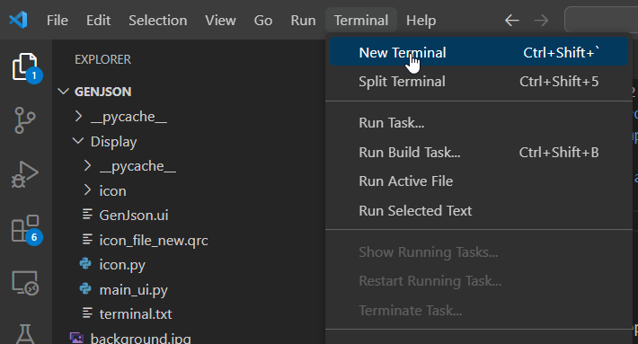
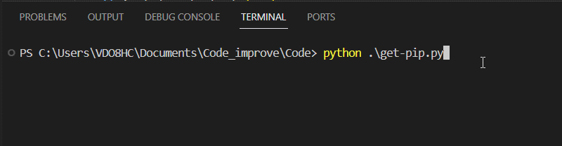
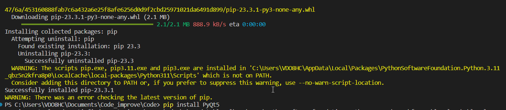

# Setup enviroment 
## Setup enviroment for pip install: 
+ Download get-pip.py at https://bootstrap.pypa.io/get-pip.py

Open get-pip.py file on Vscode and run it on terminal:
<pre>
    python get-pip.py
</pre>

## Setup enviroment for Qt5: 
<pre>
pip install PyQt5 
pip install pyqt5-tools 
pip install PyQt5Designer
</pre>

# Generate code
Generate code from .ui file to .py file for GUI
<pre>
    pyuic5 -x -o day3.py day3.ui
</pre>
Generate code from .qrc file to .py file for icon 
<pre>
    pyrcc5 -o icon.py icon_ui.qrc
</pre>

# Code basic:
<pre>
import sys
import time
from PyQt5 import QtCore, QtGui, QtWidgets
from PyQt5.QtCore import QTime, Qt
from PyQt5.QtGui import QPixmap,QIcon
from PyQt5.QtWidgets import QApplication, QMainWindow, QPushButton, QVBoxLayout, QLabel, QStackedWidget
import serial
from threading import Event
import serial.tools.list_ports
#from ui import *

class MainWindow(QMainWindow):
    def __init__(self): # cho phép bạn thiết lập các thuộc tính ban đầu của đối tượng class MainWindow
        # self là tham số đầu tiên của __init__ và đại diện cho chính đối tượng đang được khởi tạo. 
        # Bạn có thể sử dụng self để truy cập và thiết lập các thuộc tính của đối tượng.
        ## IMPORT MAIN WINDOWN USER INTERFACE ##
        QMainWindow.__init__(self)
        self.ui = Ui_MainWindow() # Create an instance of the UI
        self.ui.setupUi(self) # Set up the UI for the current object
    

## CODE RUNNING ##
if __name__ == "__main__":
    display = QtWidgets.QApplication(sys.argv) 
    # Dòng này tạo một ứng dụng Qt sử dụng QApplication. 
    #Đối số sys.argv chứa danh sách các đối số dòng lệnh
    # và nó được sử dụng để truyền các đối số dòng lệnh cho ứng dụng Qt.
    window = MainWindow() # khai bào windown bằng object MainWindow
    window.show() # hiển thị object MainWindow trên màn hình
    sys.exit(display.exec_())
    #lệnh đảm bảo rằng ứng dụng tiếp tục chạy cho đến khi người dùng đóng cửa sổ chính (hoặc chương trình thoát)

</pre>