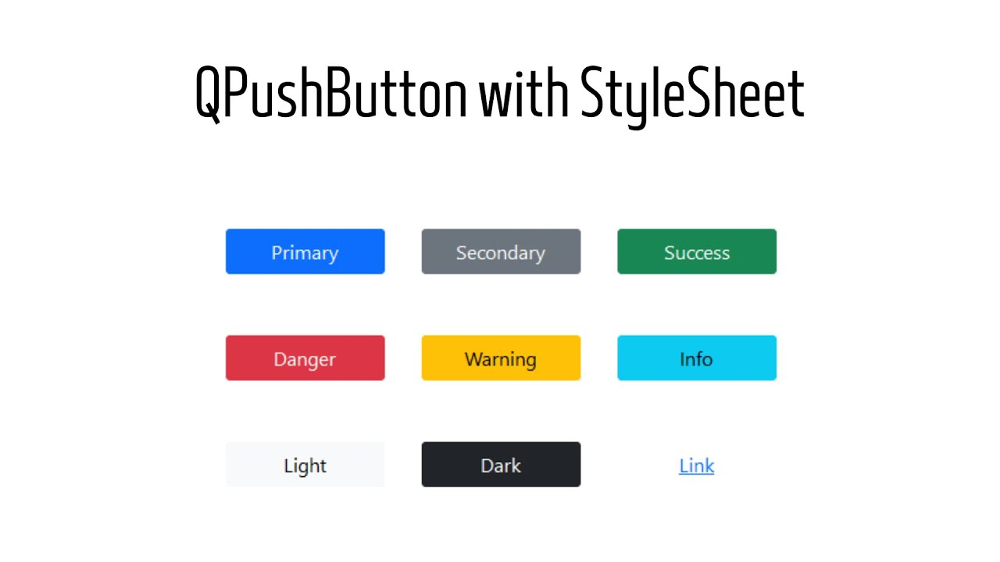
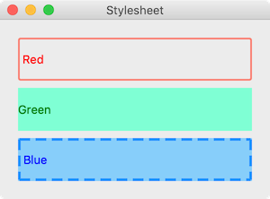

#  *Tip*
1) Color: http://ingiacong.co/bang-code-mau/
2) Icon: https://icons8.com/, https://www.flaticon.com/
3) CSS: https://xuanthulab.net/thuoc-tinh-font-family-css.html, https://www.codehub.com.vn/CSS-Co-Ban
#  *QPushButton*
##   *Command* 	 
+ Set clicked connect to function: self.ui.btn_name.clicked.connect.(function);
+ Ẩn nút: button.hide()
+ Hiển thị nút: button.show()

+ Vô hiệu hóa nút:button.setDisabled(True)

+ Kích hoạt: button.setEnabled(True)
+ Đặt gợi ý: button.setToolTip("Nhấn vào nút này")
+ Đặt icon: button.setIcon(QIcon("icon.png"))
+ Đặt phím tắt cho nút: button.setShortcut("Ctrl+N")
+ Đặt kiểu CSS cho nút: button.setStyleSheet("background-color: green; color: white")
+ delay 2s:
    - import time
    - time.sleep(2)

# *QText,QLineEdit,QLabel*
##   *QText*	 
+ setText(text): Đặt văn bản hiển thị trong phần nội dung của QText (ví dụ: QLabel, QLineEdit).

+ text(): Lấy nội dung hiện tại của QText.

+ setPlaceholderText(text): Đặt văn bản gợi ý (placeholder text) cho QText (chỉ áp dụng cho QLineEdit). Gợi ý này xuất hiện khi QLineEdit rỗng.

+ clear(): Xóa toàn bộ nội dung của QText.

+ setEnabled(enabled): Vô hiệu hóa hoặc kích hoạt QText (hoặc tương tự) dựa trên giá trị enabled.

## *QLineEdit*	 
+ setText(text): Đặt văn bản cho QLineEdit.

+ text(): Lấy văn bản hiện tại của QLineEdit.

+ setPlaceholderText(text): Đặt văn bản gợi ý (placeholder text) cho QLineEdit. Gợi ý này xuất hiện khi QLineEdit rỗng.

+ clear(): Xóa nội dung của QLineEdit.

+ selectAll(): Chọn toàn bộ văn bản trong QLineEdit.

+ setMaxLength(maxLength): Đặt giới hạn độ dài tối đa của văn bản mà người dùng có thể nhập vào QLineEdit.

+ setReadOnly(True/False): Đặt QLineEdit là chỉ đọc (read-only) hoặc có thể chỉnh sửa.

+ setValidator(QValidator): Đặt một bộ kiểm tra (validator) để kiểm tra và hạn chế văn bản mà người dùng có thể nhập vào QLineEdit.

## *QLabel*
+ setText(text): Đặt văn bản hiển thị trong QLabel.

+ text(): Lấy nội dung hiện tại của QLabel.

+ setPixmap(pixmap): Đặt hình ảnh (QPixmap) để hiển thị trong QLabel.
<pre>
label.setPixmap(QPixmap("image.png"))
</pre>

+ setAlignment(alignment): Đặt căn chỉnh của văn bản hoặc hình ảnh trong QLabel. Ví dụ: Qt.AlignCenter, Qt.AlignRight, Qt.AlignTop, v.v.
<pre>
label.setAlignment(Qt.AlignCenter)
</pre>

+ setStyleSheet(style): Đặt kiểu (style) CSS cho QLabel để tùy chỉnh giao diện.
<pre>
label.setStyleSheet("background-color: yellow; color: blue;")
</pre>

+ setOpenExternalLinks(True/False): Cho phép hoặc tắt mở các liên kết ngoài (URL) khi bạn bấm vào liên kết trong văn bản QLabel.

