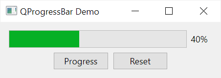

# *QCheckBox*
+ setText(text): Đặt văn bản hiển thị bên cạnh ô kiểm tra.

+ text(): Lấy văn bản hiện tại của QCheckBox.

+ isChecked(): Kiểm tra xem ô kiểm tra đã được chọn hay chưa.

+ setChecked(True/False): Đặt trạng thái của ô kiểm tra. Nếu bạn truyền True, nó sẽ được chọn; nếu bạn truyền False, nó sẽ không được chọn.

+ toggle(): Chuyển đổi trạng thái của ô kiểm tra, tức là nếu nó đã được chọn, nó sẽ trở thành không được chọn và ngược lại.
+ stateChanged() :checkbox thay đổi trạng thái
<pre>
checkbox.stateChanged.connect(self.checkboxStateChanged)
</pre>

# *QSpin*
+ setValue(value): Đặt giá trị số nguyên hiển thị trong QSpinBox.

+ value(): Lấy giá trị số nguyên hiện tại của QSpinBox.

+ setMinimum(minimum): Đặt giá trị tối thiểu mà người dùng có thể chọn.
<pre>
spinbox.setMinimum(0)
</pre>

+ setMaximum(maximum): Đặt giá trị tối đa mà người dùng có thể chọn.
<pre>
spinbox.setMaximum(100)
</pre>

+ setSingleStep(step): Đặt bước tăng/giảm giá trị khi người dùng sử dụng các nút tăng/giảm giá trị.
<pre>
spinbox.setSingleStep(5)
</pre>

+ setSuffix(suffix): Đặt một hậu tố (suffix) cho giá trị hiển thị trong QSpinBox.
<pre>
spinbox.setSuffix(" km")
</pre>

+ setPrefix(prefix): Đặt một tiền tố (prefix) cho giá trị hiển thị trong QSpinBox.
<pre>
spinbox.setPrefix("$")
</pre>

# *QSlider*
+ setValue(value): Đặt giá trị số nguyên hiển thị trong QSlider.

+ value(): Lấy giá trị số nguyên hiện tại của QSlider.

+ setMinimum(minimum): Đặt giá trị tối thiểu mà người dùng có thể chọn.
<pre>
slider.setMinimum(0)
</pre>
    
+ setMaximum(maximum): Đặt giá trị tối đa mà người dùng có thể chọn.
<pre>
slider.setMaximum(100)
</pre>
    
+ setSingleStep(step): Đặt bước tăng/giảm giá trị khi người dùng di chuyển thanh trượt hoặc sử dụng các nút bên cạnh.
<pre>
slider.setSingleStep(5)
</pre>
    
+ setOrientation(orientation): Đặt hướng của thanh trượt (ngang hoặc dọc).
<pre>
#Đặt hướng của thanh trượt (ngang): 
slider.setOrientation(Qt.Horizontal)
</pre>
+ setSliderPosition(position): 
<pre>
#Đặt vị trí của con trượt trên thanh trượt:
slider.setSliderPosition(25)
</pre>
+ slider.sliderMoved.connect(self.slider_position)
<pre>
slider.sliderMoved.connect(self.slider_position)
def slider_position(self, position):
    print("position", position)
</pre>
+ slider.sliderPressed.connect(self.slider_pressed)
<pre>

slider.sliderPressed.connect(self.slider_pressed)
def slider_pressed(self):
    print("Pressed!")
</pre>
+ slider.sliderReleased.connect(self.slider_released)
<pre>
slider.sliderReleased.connect(self.slider_released)
def slider_released(self):
    print("Released")
</pre>
+ setSliderPosition(position): 
<pre>
#Đặt vị trí của con trượt trên thanh trượt:
slider.setSliderPosition(25)
</pre>
+ valueChanged(function)Kết nối sự kiện thay đổi giá trị của thanh trượt
<pre>
slider.valueChanged.connect(function)
</pre>

# *QProgressBar*

+ setValue(value: int): Đặt giá trị hiện tại của thanh tiến trình. Giá trị phải nằm trong khoảng giữa minimum() và maximum().
<pre>
    progress_bar.setValue(50)  # Đặt giá trị tiến trình là 50
</pre>
+ value() -> int: Trả về giá trị hiện tại của thanh tiến trình.
<pre>
    current_value = progress_bar.value()  # Lấy giá trị hiện tại của tiến trình
</pre>
+ setMinimum(minimum: int) và setMaximum(maximum: int): Đặt giá trị tối thiểu và tối 
<pre>
    progress_bar.setMinimum(0)    # Đặt giá trị tối thiểu là 0
    progress_bar.setMaximum(100)  # Đặt giá trị tối đa là 100
</pre>
+ minimum() -> int và maximum() -> int: Trả về giá trị tối thiểu và tối đa của thanh tiến trình.
<pre>
    min_value = progress_bar.minimum()  # Lấy giá trị tối thiểu của tiến trình
    max_value = progress_bar.maximum()  # Lấy giá trị tối đa của tiến trình
</pre>
+ reset(): Đặt lại giá trị tiến trình về giá trị ban đầu.
<pre>
    progress_bar.reset()  # Đặt lại giá trị tiến trình
</pre>
+ setFormat(format: str): Đặt định dạng văn bản cho tiến trình. Bạn có thể sử dụng %p để hiển thị phần trăm.
<pre>
progress_bar.setFormat("%p%")  # Hiển thị phần trăm tiến trình
</pre>
+ setTextVisible(visible: bool): Đặt trạng thái hiển thị văn bản trên thanh tiến trình.
<pre>
progress_bar.setTextVisible(True)  # Hiển thị văn bản trên thanh tiến trình
</pre>
+ setRange(minimum: int, maximum: int): Đặt giá trị tối thiểu và tối đa cùng một lúc.

<pre>
progress_bar.setRange(0, 100)  # Đặt giá trị tối thiểu và tối đa là 0 và 100
</pre>
+ setInvertedAppearance(inverted: bool): Đặt trạng thái hiển thị đảo ngược. Nếu là True, giá trị sẽ được hiển thị từ phải sang trái.
<pre>
    progress_bar.setInvertedAppearance(True)  # Hiển thị giá trị từ phải sang trái
</pre>

# *QCombobox*
+ addItem(text: str, userData: Any = None): Thêm một mục mới vào QComboBox với văn bản được hiển thị là text. userData có thể là một giá trị tùy chọn được gán cho mục.
<pre>
combo_box.addItem("Option 1", 1)
</pre>
+ addItems(items: Iterable[str]): Thêm nhiều mục cùng một lúc bằng cách cung cấp một danh sách các văn bản.

<pre>
options = ["Option 1", "Option 2", "Option 3"]
combo_box.addItems(options)
</pre>
+ currentIndex() -> int: Trả về chỉ số của mục đang được chọn.
<pre>
current_index = combo_box.currentIndex()
</pre>
+ currentText() -> str: Trả về văn bản của mục đang được chọn.
<pre>
current_text = combo_box.currentText()
</pre>

+ clear(): Xóa tất cả các mục khỏi QComboBox.
<pre>
combo_box.clear()
</pre>
+ count() -> int: Trả về số lượng mục trong QComboBox.
<pre>
item_count = combo_box.count()
</pre>
+ setItemText(index: int, text: str): Đặt văn bản cho mục tại chỉ số index.
<pre>
combo_box.setItemText(0, "New Option 1")
</pre>

+ itemText(index: int) -> str: Trả về văn bản của mục tại chỉ số index.
<pre>
text_at_index = combo_box.itemText(1)
</pre>
+ insertItem(index: int, text: str, userData: Any = None): Chèn một mục mới vào QComboBox tại chỉ số index.
<pre>
combo_box.insertItem(1, "Inserted Option", 2)
</pre>

+ removeItem(index: int): Xóa mục tại chỉ số index khỏi QComboBox.
<pre>
combo_box.removeItem(2)
</pre>

# *QStackedWidget*
+ addWidget(widget: QWidget): Thêm một QWidget mới vào QStackedWidget.
<pre>
stacked_widget.addWidget(child_widget)
</pre>
+ insertWidget(index: int, widget: QWidget): Chèn một QWidget vào QStackedWidget tại một vị trí cụ thể.
<pre>
stacked_widget.insertWidget(1, new_widget)
</pre>
+ setCurrentIndex(index: int): Đặt QWidget hiện tại bằng cách chỉ định chỉ số của nó trong QStackedWidget
<pre>
stacked_widget.setCurrentIndex(2)
</pre>
+ currentWidget() -> QWidget: Trả về con QWidget hiện tại đang được hiển thị.
<pre>
current_widget = stacked_widget.currentWidget()
</pre>
+ setCurrentWidget(widget: QWidget): Đặt QWidget hiện tại bằng cách truyền vào đối tượng QWidget cụ thể.
<pre>
stacked_widget.setCurrentWidget(specific_widget)
</pre>